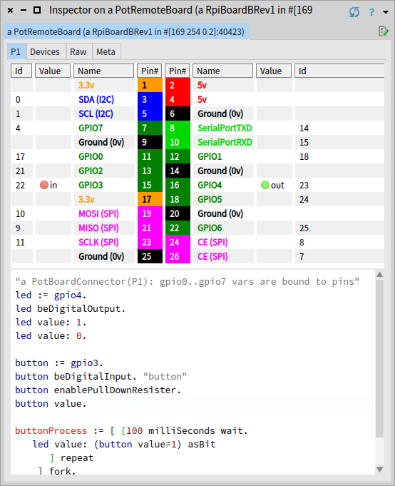
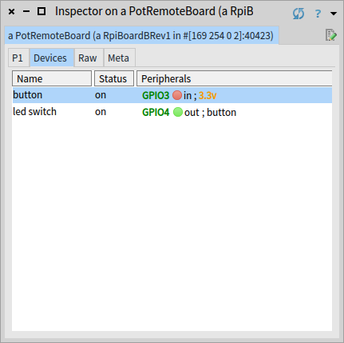

# PharoThings

Live programming platform for IoT projects based on [Pharo](http://pharo.org).
It includes:
- development tools to lively program, explore and debug remote boards (based on [TelePharo](https://github.com/dionisiydk/TelePharo))
- board modeling library which simplifies board configuration

    - Raspberry driven by [WiringPi library](http://wiringpi.com)
    - Arduino driven by [Firmata](https://github.com/firmata/arduino), soon
    - Beaglebone, soon

## Installation on Raspberry

1) Download Pharo 6 and install server part of PharoThings:
```Smalltalk
Metacello new
  baseline: 'PharoThings';
  repository: 'github://pharo-iot/PharoThings/src';
  load: #(RemoteDevServer Raspberry).
```
At the end save the image.

2) Download ArmVM http://files.pharo.org/vm/pharo-spur32/linux/armv6/latest.zip. It will run Pharo on your board

3) Copy saved image, changes, sources and ArmVM files into your Raspberry (files should be in same directory)

4) Install [WiringPi library](http://wiringpi.com) in Raspberry

If you use the latest desktop version of Raspbian skip this step (WiringPi is included). Light Raspbian version is required manual installation of WiringPi.

PharoThings uses WiringPi to control Raspberry pins. You need install it in your board. There is convenient prebuilt package [here](https://github.com/hamishcunningham/wiringpi/tree/master/package/2.13/unstable). Follow [install](https://github.com/hamishcunningham/wiringpi/blob/master/INSTALL) instructions or do it your own way.

5) Start Pharo on Raspberry with server option:
```bash
pharo --headless Server.image  remotePharo --startServerOnPort=40423
```
It will listen remote IDE connections on port 40423.

You can also prepare image with running server. Evaluate following code in playground and save the image:
```Smalltalk
TlpRemoteUIManager registerOnPort: 40423
```
In that case command line option --startServerOnPort is not needed. Just start Pharo with --no-quit option:
```bash
pharo --headless Server.image  --no-quit
```

## Connecting to the board
Install client part of PharoThings to development (client) Pharo image:
```Smalltalk
Metacello new
  baseline: 'PharoThings';
  repository: 'github://pharo-iot/PharoThings/src';
  load: 'RemoteDev'
```
Connect to remote Pharo running on Raspberry using playground:
```Smalltalk
remotePharo := TlpRemoteIDE connectTo: (TCPAddress ip: #[193 51 236 167] port: 40423)
```
Notice that you should know IP address of your Raspberry and port where running Pharo is waiting for remote IDE connection. In this example we used port 40423.

With remotePharo instance you can open many different tools to develop and explore remote Pharo image. It is part of [TelePharo project](https://github.com/dionisiydk/TelePharo). Look at it for details. 

Here we are using specialized Raspberry tools.

## Inspecting the board
To inspect the board you need to know concrete model of Raspberry. Currently only model B is supported (with revision 1 and 2). But you can play with following code on other boards too to get feeling of this project. In that case pins could point to wrong phisical pins of your board. But tools will not break and will show the same working UI. Also you are always able to work with board by low level library (like WiringPi) using powerfull remote tool from [TelePharo](https://github.com/dionisiydk/TelePharo).

By the way implementation of specific Raspberry model is very simple task (will be explained later). Feel free to support it and contribute to the project. 

So for your board model you need to choose appropriate board class. For Raspberry it will be one of the RpiBoard subclasses.
With choosen class evaluate following code to open inspector:
```Smalltalk
remoteBoard := remotePharo evaluate: [ RpiBoardBRev1 current].
remoteBoard inspect
```
In this case we work with Raspberry model B revision 1.

## The board inspector



The board inspector provides scheme of pins similar to Raspberry Pi docs.
But here it is a live tool which represents current pins state. 

In picture the board is shown with two configured pins: gpio3 and gpio4 which are connected to physical button and led accordingly.

Digital pins are shown with green/red icons which represent high/low (1/0) values. In case of output pins you are able to click on icon to toggle the value. Icons are updated according to pin value changes. If you click on physical button on your board the inspector will show updated pin state by changing icon color.

The evaluation pane in the bottom of the inspector provides bindings to gpio pins which you can script by #doIt/printIt commands. Example shows expressions which were used to configure button and led.

For led we first introduced named variable #led which we assigned to gpio4 pin instance:
```Smalltalk
led := gpio4
```
Then we configured pin to be in digital output mode and set the value:
```
led beDigitalOutput.
led value: 1
```
It turned the led on.

For button we did the same but with digital input mode and extra resistor configuration:
```Smalltalk
button := gpio3.
button beDigitalInput. "button"
button enablePullDownResister.
```
You can notice that gpio variables are not just numbers/ids. PharoThings models board with first class pins. They are real objects with behaviour. For example you can ask pin to toggle value:
```
led toggleDigitalValue
```
Or ask pin for current value if you want to check it:
```Smalltalk
led value.
button value
```
Following demo shows inspector in live:

[](https://www.youtube.com/watch?v=0H9of7PQet0)

## The device model
Pin scripting is cool and powerful feature but when you need real logic for your pins it is better to put it in objects.

PharoThings provides simple high level model of devices which you can use to implement complex interaction with your board.

For example with button device you can subscribe on #press/release events:
```Smalltalk
button := board installDevice: (PotButton named: 'button' fromPowerTo: gpio3).
button when: PotButtonReleased send: #toggleDigitalValue to: led.
```
It will connect physical button to the led as a switch device which turns the led on and off on button click. 

Devices incapsulate pin configuration logic. You don't need configure input pin manually when you create button instance. Just install device and pin will work. 

Notice that in example the physical button is connected to the gpio pin from the power. That is why we use "named:fromPowerTo:" selector when we create button instance. But button can be connected another way too. And in that case we would use selector #named:fromGroundTo:. It is important to create instance in the same way as it is connected in the real world because otherwise button will not work. The reason will be explained later. This logic is hidden by PotButton class and users do not need to think about it.

Now to toggle led we still use script inside inspector. We can replace it with another device PotSwitch:
```Smalltalk
button unsubscribe: led. "disable previous script behaviour"
board installDevice: (PotSwitch named: 'led switch' for: gpio4 using: button).
```
(first line is required because instead toggle will be performed twice which will not change anything)

Board inspector provides extra tab to manage installed devices:



This tab shows live state of devices. You can click on output pins to modify value.

From context menu you can disable and remove devices. Also you can browse implementation.

Following demo shows devices in live:

[](https://www.youtube.com/watch?v=ezfjditHjq4)

## Implementing new devices

This topic will be described in details later. Now look at following demo as a simple example how develop and debug the live Raspberry remotelly:

[](https://www.youtube.com/watch?v=5i0tsgFtlOg)

## Persist board changes
If board is configured you can save the remote image to persist board changes:
```Smalltalk
remotePharo saveImage
```
When you restart the image board pins will restore saved state and installed devices will continue working.

For example try save the board with led on. Then turn the led of and restart the Pharo. When Pharo will start the led will be on (because the image was saved in that state).

All processes running in Pharo are also persistent. For example from inspector you can connect button pin to the led with simple process:
```Smalltalk
[ [100 milliSeconds wait. 
	led value: (button value=1) asBit
		] repeat	
	 ] forkNamed: 'button process'.
```
It will turn the led on when the button is pressed. 

Now if you save the image this process will continue working after Pharo restart. And the button on your board will turn the led on every time you press the button.

All videos above show persistence in live.
